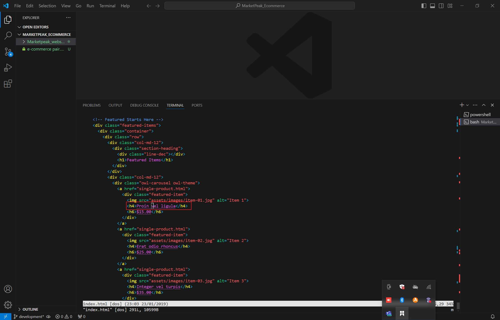
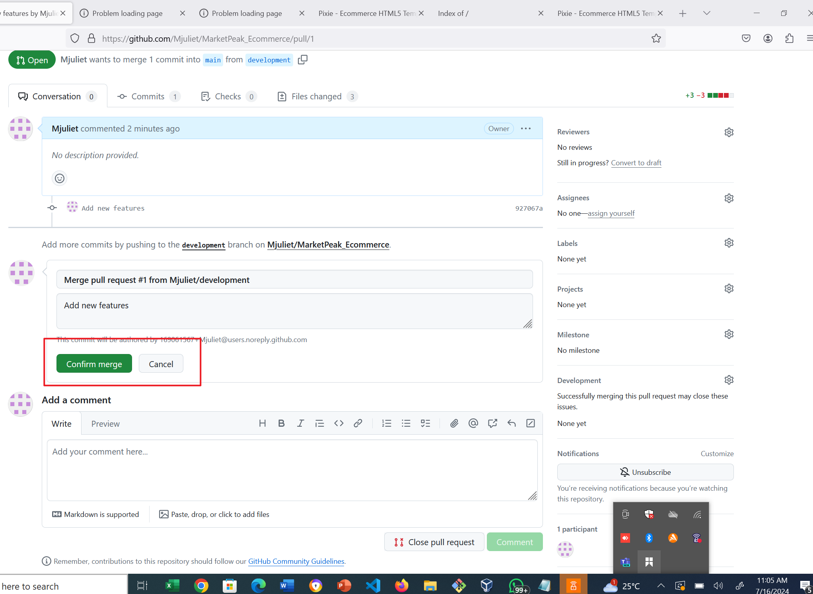
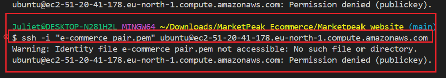
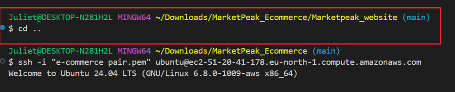
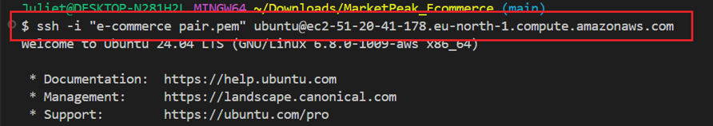

# **E-COMMERCE PLATFORM DEPLOYMENT WITH GIT, LINUX, AND AWS**.

You have been assigned to develop an e-commerce website for a new online marketplace named "MarketPeak." The platform will feature product listings, a shopping cart, and user authentication. The objective of this project is to utilize Git for version control, develop the platform in a Linux environment, and deploy it on an AWS EC2 instance.

# **Below are the Project Execution Steps**.
For a successful execution of this project, you will have to follow the steps listed below:

### **1. Git version control setup**


*1.1 Git Repository Initialization*


*1.2. Obtain and prepare an E-commerce Website Template*

*1.3. Stage and commit the template to Git*

*1.4. Push the code to your Github repository.*

### **2. AWS Deployment**

*2.1. AWS EC2 Instance Setup*

*2.2. Clone the repository on the Linux Server*

*2.3. Web Server Installation*

*2.4. Server Configuration*

*2.5. Website Access*

### **3.Contineous Integration and Deployment Workflow **

*3.1. Developing new features and fixes*

*3.2. Version control with Git*

*3.3. Pull Request and Merging to the main branch*

*3.4. Deploying Updates to the Production Server*

*3.5. Testing the new changes*


### **1. Git version control setup** :
To start up this project, the first step is to implement Version Control with Git. Version control is a system that tracks and manages changes to digital content over time. It helps you track changes, collaborate, backup, experiment and revert changes. Git is a powerful tool for version control.and to do this, you have to  start with:

**1.1 Git Repository Initialization** : 
- Open a  Git terminal, navigate to a directory. A directory (also known as a folder) is a container for storing files and other directories on a computer. It's a way to organize and structure data on a file system. Anywhere you see me mention "directory" in this project, just know I'm also referring to a folder.
In this case we will navigate to the  Downloads folder using this command, ~cd ~/Downloads.

  ```
  ~cd ~/Downloads
  ```


  It is a command that changes the current directory to your user's home directory.


- Once in the Downloads folder, procede to create a directory for the project named "MarketPeak_Ecommerce". To do this you will use the command "mkdir"

  ```
  mkdir MarketPeak_Ecommerce
  ```

 
  "mkdir" command allows you to create a new directory (or folder) in the current location.

  

- Then you change directory into the folder that was just created, which is the project directory 

 ```
 cd MarketPeak_Ecommerce
 ```


  

- while in the Project directory, run the command 
```
code .
``` 


"Code ." is a command that opens the current directory in Visual Studio Code (VS Code), a popular code editor. Working on the VS Code will enable you also carry out yor documentation. This step is optional.
 

- After creating the project directory and changing directory into it, the next step is to initialize the project directory using the command `git init`.

  ```
  git init
  ``` 
  
  is a command that creates a new Git repository in the current directory. This sets up a .git folder, which contains all the necessary metadata for Git to track changes and versions of the files. It shows that your work is being tracked by git.

  

With all the steps taken above, you have succeded in  Git Repository Initialization.

**1.2. E-commerce Website Template**

- To continue in this project, the next step is to develop a website, and in order to do this, you have to first `download a static website`. A static website is a basic website with unchanging content, like a digital brochure. You can visit Tooplate or any other free template resource, and download a suitable e-commerce website template.

  


- prepare the website Template: Extract the downloaded template into your project directory, **MarketPeak_Ecommerce.

   Feel free to customize the template if you have basic web development skills, like updating logos etc, but then this totally optional.


**1.3. Stage and commit the template to Git`**

After the E-commerce website has been downloaded, the next step is to stage and commit the website to Git through the following steps;

 ```
 git add
 ```
 
  It is a Git command that stages all changes in the current directory and subdirectories for the next commit.

   

- After adding the website files to the Git repository, the next step is to set up a Git global cofiguration with username and email;

   `git config --global user.name "Chinasa Madu"`

  

  `git config --global user.email "mjuliet013@gmail.com"`

  

- After setting up a git configuration with username and email, you can go ahead to commit your changes with a clear descriptive message.
```
git commit -m "initial commit with basic e-commerce site structure"
```

 git commit is a command that saves changes to the local repository, it also commits the staged changes with a meaningful message.


  .


**1.4. Push the code to your Github repository.**

After initializing your Git repository and adding your e-commerce website template, the next step is to push your code to your remote repository on GitHub. This step is crutial for version control and collaboration.

- You have to log into your GitHub account and create a a new repository named "MarketPeak_Ecommerce.


- The next step is to link your local repository to GitHub: In your terminal, within your project directory, add the remote repository URL to your local repository configurationtion.(A local repository in Git is a repository stored on your local machine while a remote repository is  hosted on a server, typically on a cloud platform or a self-managed server,shared with others, allowing multiple developers to collaborate on the same project.)

  To accomplish this, in your project directory type
  
   ```
   git remote add origin[paste the copied url]
   ```
    then navigate back to your GitHub and copy the URL of the repository you just created and paste on the terminal immediately after the typed `git remote add`.

  
Notice that this gave out an error message, because the url was not properly cofigured, in order to avoid the error message, you have to make sure you copy your remote repository URL and past after typing **git remote add origin**.

  git remote add origin https://github.com/your-git-username/MarketPeak_Ecommerce.git


  
**Note** : Make sure to replace your "your-git-username" with your actual git username.

- Push your code: Upload your local repository content to GitHub using the command.

  ```
  git push -u origin main
  ```

  This command pushes committed changes from your local repository to the remote repository named "origin". Git uploads the committed changes from your local "main" branch to the remote "main" branch.


  Note: In Git, the default local branch name is often "master", but many repositories have switched to using "main" as the default branch name. Running this command on the default branch name "master will give an error message.

  

   In order to correct this error, you will need to rename your default branch name from "master" to "main"

  ```
  git branch -m master main
  ```

  git branch -m master main is a Git command that renames the current branch from "master" to "main.

  
Once you run this command, you will observe that the branch name will change immediately from "master" to "main" .

  Now you can go ahead and push your code again.
  


### **2. AWS Deployment**
Moving on to the second step of the project which is "AWS Deployment. 

AWS (Amazon Web Services) is a comprehensive cloud computing platform provided by Amazon that offers a wide range of services for computing, storage, databases, analytics, machine learning, and more.AWS Deployment refers to the process of hosting and running applications, services, and workloads on Amazon Web Services (AWS).

To deploy "MarketPeak_Ecommerce" platform, you'll start by setting up an Amazon Ec2 instance.

**2.1. EC2 Instance Setup**

- Log in to the AWS Management Console.
- Launch an EC2 instance using an Amazon Ubuntu AMI.

  An EC2 (Elastic Compute Cloud) instance is a virtual server in Amazon Web Services (AWS) that provides scalable computing capacity. It's a core component of AWS, allowing users to run applications, services, and workloads in the cloud.
  

  - Connect to the instance using SSH

    Follow the steps below to do this
  ```
    1. Open your SSH client.
    2. Specify the username:
       - For Amazon Linux, use ec2-user.
       - For Ubuntu, use ubuntu.
       - For other OS, use the default username or check the instance's documentation.
   3. Specify the public DNS name or public IP address of    your instance.
   4. Specify the path to your private key file (.pem).
   5. Connect to the instance using the SSH command:
    - ssh -i /path/to/your/key.pem username@public-dns-name

    
    ```

 **2.2. Clone the repository on the Linux Server**
 Before deploying your e-commerce platform, you need to clone the GitHub repository to your AWS EC2 instance. This process involves authenticating with GitHub and choosing between two primary methods of cloning a repository: **SSH** and **HTTPS** .

 **Note: In this project you will make use of the HTTPS Method**
 
 - Navigate to your repository in github console

 - Select the code as highlighted.
 
 

 - Copy the **HTTPS URL**, navigate to your ubuntu instance and type "git clone" then paste the URL you copied.

  ```
  git clone https://github.com/yourusername/MarketPeak_Ecommerce.git
  ````

**2.3. Web Server Installation**

Install Apache HTTP Server: a widely used web server that serves HTML files and content over the internet. Installing it on your Linux EC2 server allows you to host **MarketPeak E-commerce** site.
To install Apache, follow these steps.

1.
 ```
sudo apt update -y
```

   The command sudo apt update -y is used to update the package index on a Debian-based Linux system, such as Ubuntu.


2. 
```
sudo apt install Apache2
```

   The command sudo apt install apache2 is used to install the Apache HTTP Server on a Debian-based Linux system, such as Ubuntu.

   

3. 
```
sudo systemctl restart Apache2
```

   The command sudo systemctl restart apache2 is used to restart the Apache2 service on a system that uses systemd as its init system, such as modern Ubuntu versions.

   

4. 
```
sudo systemctl enable apache2
```

   The command sudo systemctl enable apache2 is used to enable the Apache2 service to start automatically on boot on a system that uses systemd as its init system, such as modern Ubuntu versions.

   

   **2.4. Server Configuration(Configure httpd)**

   To serve the website from the EC2 instance, configure httpd to point to the directory on the Linux server where the website code files are stored. Usually in /var/www/html.
   
   
Follow the steps below.

1. **Prepare the Web Directory**: Clear the default Apache2 web directory and copy MarketPeak Ecommerce website files to it.

To clear;

```
sudo rm -rf /var/www/html/*
```

The command sudo rm -rf /var/www/html/* is used to delete all files and subdirectories in the /var/www/html directory, which is the default document root for Apache web server on many Linux distributions.


To copy;

```
sudo cp -r ~/marketPeak_Ecommerce/* /var/www/html
```

The command sudo cp -r ~/marketPeak_Ecommerce/* /var/www/html is used to copy all files and subdirectories from the marketPeak_Ecommerce directory in your home directory (~) to the /var/www/html directory, which is the default document root for Apache web server on many Linux distribution.


2. Reload Apache2 : In order to apply the changes you have reload the service.

```
sudo systemctl reload Apache2
```

The command sudo systemctl reload apache2 is used to reload the Apache2 web server configuration without restarting the service.


**2.5. Website Access**
With Apache2 configured and website files in place, **MarketPeak Ecommerce platform should now  be live on the internet.

- Access the public IP of your EC2 instance, copy the IP address and past on a web browser to view the deployed website.


- There are chances your website might appear in a folder, if you have been following the instructions, but to correct this, you have to move the contents of MarketPeak_website folder to var/www/html.
To achieve this, on your terminal, ssh into your instance, then cd into MarketPeak_Ecommerce directory,then cd into MarketPeak_website directory. The next step is to use the command "sudo mv -/Marketpeak_website/* /var/www/html/"
 to move the contents.

  Because the **mv** command is trying to move the file to a directory that already exist,you will encounter an error, to resolve this,use the -n option with the the mv command which will prevent overwritting existing files. Run the command 
  ```
  sudo mv -n* /var/www/html/
  ```
   The command sudo mv -n * /var/www/html/ is used to move files and directories from the current directory to the /var/www/html/ directory, without overwriting existing files.

  

- Access the public IP of your EC2 instance again, copy the IP address and past on a web browser to view the website, it should not appear in a folder again.

  .

  ### **3.Contineous Integration and Deployment Workflow **

  To ensure a smooth workflow for developing, testing, and deploying your e-commerce platform, follow this structured approach. It covers making changes in a development environment, utilizing version control with Git, and deploying updates to your production.

  **Step 1:** Developing New Features and Fixes.

  a. Creat a Development Branch:Begin your development work by creating a seperate branch. This isolates new features and bug fixes from the stable version of your website.

    To start, exit from your instance, in order to navigate to your main branch.


     

 b. Once in your main branch, create a development branch through these steps.

```
git branch development
```
      
  Creates a new branch named "development" from the current branch (usually the main or master branch).

  


c. 
```
git checkout development
```
 Switches the current branch to the newly created "development" branch.


d. Implement Changes: On the development branch, add your new features or bug fixes. This might include updating web pages, adding new products, or fixing issues. 
- On your development branch,run the command **ls**, then cd into your Marketpeak_website which is the name of your downloaded website.

  ```
  cd Marketpeak_website
  ```

  

- run the **ls** command

```
ls
```


  
    
- Using Vim, edit one of the files in Marketpeak_website. Vim is a powerful text editor. In this case edit the **index.html** file.To edit type vi index.html.

```
vi index.html
```




- After implementing changes of your choice, run the the command ecs:wq.


```
esc :wq
``` 
This command is used to  save the current file and exit Vim editor when you are done editting.


**Step 2:** Version Control with Git.

- Stage your changes: After making your changes, add them to the staging area with Git.

```
git add .
```


- Commit your changes: Make sure to save your changes in the Git repository with a commit. Do not forget to include a message about the updates.

```
git commit -m "Add new features"
```


- Push your Changes to GitHub: Upload your development branch to GitHub with the new changes. This enables collaboration and version tracking.

```
git push origin
```


**Step 3:** Pull Request and Merging to the main branch

- Creat a Pull Request (PR): A pull request (PR) is a way to propose changes to a repository's codebase by requesting that changes made in one branch (usually a feature branch) be merged into another branch (usually the main branch).
After pushing your changes to Github,navigate to GitHub, create a pull request to merge the development branch into the main branch. This process is crucial for code review and maintaining code.


- Review and Merge the PR: Review the changes for any potential issues the merge the pull request into the main branch if you are satisfied.

.

- Switch back to the main branch.

```
git checkout main
```


- The next step is to merge.This will Merge the development branch into your local main branch.

```
git merge development
```

.

- Push the merged changes to GitHub:Ensure that your local main branch, now containing the updates, is pushed to the remote repository on GitHub.

```
git push origin main
```

**NOTE**: You have to make sure you have the latest changes on your local branch before pushing or you will encounter an error.

To correct the error, pull the latest changes to your local branch.

```
git pull
```

git pull is a Git command that fetches changes from a remote repository and merges them into your local branch.


- Now that your local branch has all the latest change, you can go ahead and push the merged changes to git.


**Step 4**:
Deploying Updates to the Production Server

- Pull the Latest Changes on the Server: SSH into your AWS EC2 instance where the production website is hosted. 
Navigate to the website's directory and pull the latest changes from the main branch.

`ssh`



**NOTE** Make sure to navigate to the directory where you have your pem file downloaded and ssh into that directory to avoid an error.

```
cd ..
```


 `ssh` 
 
 ssh again into your instance.

 


 After you have ssh into your instance,run `ls` command, then change directory into your website directory.

 `cd`

 

```
git pull origin main
```

 Pulls the latest changes from the main branch .


- Restart the web server: This will help to apply the changes you worked on.

```
sudo systemctl reload Apache2
```

.

**Step 5:** Testing the new changes

- Access the website: Open a web browser and navigate to the IP address of your EC2 instance. Test the new features or fixes to ensure they worked.


### TROUBLESHOOTING ### 

These are some of the challenges I faced while I was working on the project and how I managed to resolve them. You may or may not encounter them, but do well to take note of them as it might help you navigate through errors or challenges in the future.

1.git remote add origin-error: After creating a remote repository on GitHub named "MarketPeak_Ecommerce".The next step is to link my local repository to GitHub, I copied the URL and edited with the wrong name but this popped up an error


- **solution:** I copied and pasted the URL from the remote repository without making further editing.

```
git remote add origin https://github.com/mjuliet/MarketPeak_Ecommerce.git
```


**2. Git push-error**: After linking my local repository to GitHub. When I tried to push the code to my GitHub repository using the "git push origin main" command, an error message popped up stating  refspec "main" doesn't match any references on the remote repository.


- **solution:** I changed my local repository default branch name from "master" to "main" using the command 

```
git branch -m master main
```


3. Website access error: After configuring my Apache2 server for website and reloading, I needed to access the Public IP of my EC2 instance to view the deoloyed website but it appeared in a folder.


- **solution:** In order to correct the fact that my website appears in folder.I moved the contents of Marketpeak_website folder to var/www/html. To achieve this, on my terminal, I ssh into the instance, then cd into MarketPeak_Ecommerce directory,then cd into MarketPeak_website directory. The next step is to use the command "sudo mv -/Marketpeak_website/* /var/www/html/"
 to move the contents.

  Because the **mv** command is trying to move the file to a directory that already exist, I encounterd an error, to resolve this,I used the -n option with the mv command which will prevent overwritting existing files. I ran the command `sudo mv -n* /var/www/html/` The command sudo mv -n * /var/www/html/ is used to move files and directories from the current directory to the /var/www/html/ directory, without overwriting existing files.

  
  
  

  4. git push-error:
  After creating  a Pull Request(PR) and merging the development branch into the main branch. I needed to Push the merged changes to GitHub using the command "git push origin main" but this popped up an error stating that updates were rejected because the remote contains work that you do not have locally.

  
  

- **solution:** I pulled the latest changes into the main branch to enable me push using the git pull command. Then I was able to push.

```
git pull
```


5.SSH -error: Trying to SSH into my AWS EC2 instance where the production website is hosted in order to pull the latest changes from the main branch. I encountered an error because I SSH into the the marketpeak_website directory


- **solution:** I changed directory to my MarketPeak_Ecommerce directory, which has my pem key, using the "cd .." command.

```
cd ..
```


6. git pull error.
In order to deploy updates to the production server, I needed to pull the latest changes on the Server by running the command "git pull origin main" while logged in on my AWS EC2 instance. This popped up an error because, I ran the git pull origin main command in a directory that is not my project directory .


- **solution:**
I changed directory to my MarketPeak Ecommerce then ran the git pull


Thank you.


    

    


  


         


